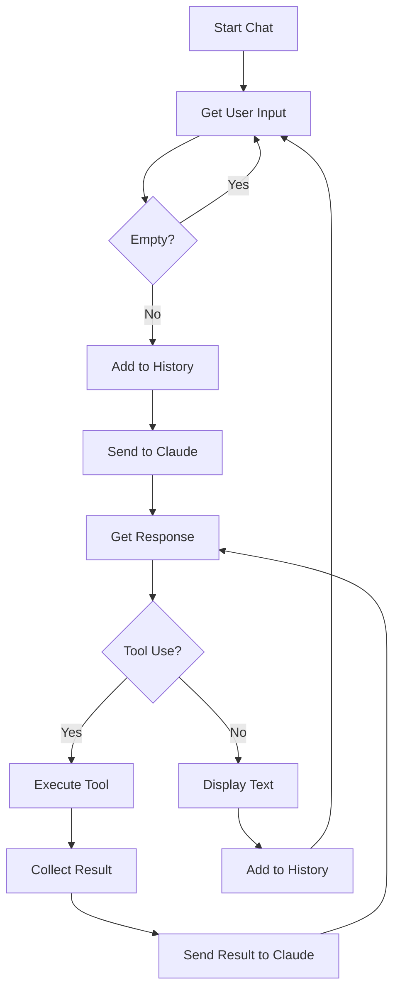

# Chapter 2: Introducing Tools

This chapter introduces the concept of **Tools** to the agent, enabling it to perform actions beyond simple conversation—starting with file reading capabilities.

## The Goal

In Chapter 1, the agent could only converse. Now we extend it with the ability to **use tools**. The focus here is on creating the first tool (`read_file`) and integrating it into the agent's reasoning loop.

## File Structure

```
chapter2/
└── read_file.ts    # Agent with read_file tool
```

## Code Walkthrough

### 1. Tool Definition with Zod Schema

```typescript
import { z } from 'zod';

const ReadFileInputSchema = z.object({
    path: z.string().describe("Path to the file to read"),
});
```

**What's happening:**
- Zod provides runtime validation and TypeScript types
- The `.describe()` method adds documentation that Claude sees in the tool definition
- This schema defines what parameters the tool accepts

### 2. Tool Execution Function

```typescript
import { readFile } from "fs/promises";

const ReadFile = async (args: z.infer<typeof ReadFileInputSchema>): Promise<string> => {
    return await readFile(args.path, "utf-8");
}
```

**What's happening:**
- `z.infer<typeof ReadFileInputSchema>` extracts the TypeScript type from the Zod schema
- The function returns a `Promise<string>` — all tools must return strings
- Uses Node's `fs/promises` for async file reading

### 3. ToolDefinition Interface

```typescript
interface ToolDefinition {
    Param: Anthropic.Tool;
    Execute: (args: any) => Promise<string>;
}

const ReadFileToolDefinition: ToolDefinition = {
    Param: {
        name: "read_file",
        description: "Read the contents of a given relative file path. Use this when you want to see what's inside a file. Do not use this with directory names.",
        input_schema: GenerateSchema(ReadFileInputSchema)
    },
    Execute: ReadFile
}
```

**What's happening:**
- `ToolDefinition` combines the API schema (`Param`) with the executor function (`Execute`)
- `Param` follows Anthropic's tool format: `name`, `description`, and `input_schema`
- The description helps Claude understand when and how to use the tool

### 4. Schema Generation

```typescript
function GenerateSchema(v: z.ZodType): Anthropic.Tool['input_schema'] {
    const schema = (v as any).toJSONSchema()
    return {
        type: "object",
        properties: schema.properties,
        required: schema.required,
    }
}
```

**What's happening:**
- Converts Zod schema to JSON Schema format required by Anthropic's API
- Extracts `properties` and `required` fields from Zod's JSON Schema output

### 5. Agent with Tools Support

```typescript
class Agent {
    private tools: ToolDefinition[];

    constructor(
        client: Anthropic,
        rl: readline.Interface,
        verbose: boolean,
        tools: ToolDefinition[]  // New: accepts tools array
    ) {
        this.tools = tools;
    }

    async runInference(conversation: Anthropic.MessageParam[]) {
        const anthropicTools: Anthropic.ToolUnion[] = this.tools.map(tool => tool.Param);

        const message = await this.client.messages.create({
            model: "claude-3-5-haiku-latest",
            max_tokens: 1024,
            messages: conversation,
            tools: anthropicTools,  // Pass tools to API
        });
        return message;
    }
}
```

**What's happening:**
- Agent now accepts an array of `ToolDefinition` objects
- `runInference` maps tool definitions to Anthropic's format and passes them to the API
- Claude now sees these tools and can choose to call them

### 6. The Tool Use Loop

```typescript
while (true) {
    let hasToolUse = false;
    let toolsResults: Anthropic.ContentBlockParam[] = [];

    for (const block of message.content) {
        if (block.type === "text") {
            console_out.claude(block.text);
        } else if (block.type === "tool_use") {
            hasToolUse = true;
            const toolToUse = block.name;
            let toolResult: string | undefined;
            let toolErrorMsg: string | undefined;

            // Find and execute the tool
            for (const tool of this.tools) {
                if (tool.Param.name === toolToUse) {
                    try {
                        toolResult = await tool.Execute(block.input);
                    } catch (err) {
                        toolErrorMsg = err instanceof Error ? err.message : String(err);
                    }
                    break;
                }
            }

            // Collect result for API
            toolsResults.push({
                type: "tool_result",
                tool_use_id: block.id,
                content: toolErrorMsg || toolResult,
                is_error: !!toolErrorMsg
            });
        }
    }

    if (!hasToolUse) {
        console_out.finishClaudeTurn();
        break;  // No more tools, exit loop
    }

    // Send results back to Claude
    conversation.push({ role: "user", content: toolsResults });
    message = await this.runInference(conversation);
    conversation.push({ role: "assistant", content: message.content });
}
```

**What's happening:**
1. **Check response blocks**: Iterate through Claude's response content
2. **Handle text**: Display any text blocks immediately
3. **Handle tool_use**: When Claude requests a tool:
   - Find the matching tool by name
   - Execute it with the provided input
   - Catch errors and mark as `is_error: true`
   - Collect results with the original `tool_use_id`
4. **Exit condition**: If no tools were called, the turn is complete
5. **Continue loop**: Send tool results back to Claude and process the new response

## Key Concepts

### Tool Use Content Blocks

Claude's response can contain multiple block types:

```typescript
message.content = [
    { type: "text", text: "I'll read that file for you." },
    { type: "tool_use", id: "toolu_123", name: "read_file", input: { path: "./file.txt" } }
]
```

### Tool Result Format

Results are sent back as `tool_result` blocks:

```typescript
{
    type: "tool_result",
    tool_use_id: "toolu_123",  // Must match the tool_use id
    content: "File contents here...",
    is_error: false
}
```

## Flow Diagram



## How to Run

```bash
# Standard run
bun run chapter2/read_file.ts

# With debug logging
bun run chapter2/read_file.ts --verbose
```

## What's Next?

Chapter 2 establishes the tool pattern with a single tool. In **Chapter 3**, we add more tools (`list_files`) to demonstrate how multiple tools work together, allowing Claude to explore the filesystem.
