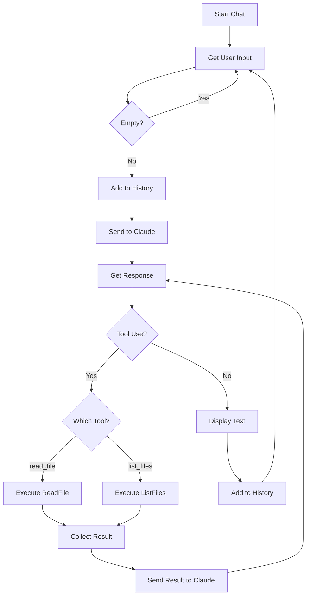

# Chapter 3: Extending Tools

This chapter demonstrates how to **extend the tool set** by adding new capabilities following the pattern established in Chapter 2.

## The Goal

In Chapter 2, we created `read_file`. Now we extend the agent with a second tool: `list_files`. This shows how the same pattern scales to multiple tools.

## File Structure

```
chapter3/
├── read_file.ts    # Agent with read_file tool
└── list_files.ts   # Agent with list_files tool
```

Note: Each file is a complete, standalone agent with its own tool. This demonstrates how tools can be developed and tested independently.

## Code Walkthrough

### 1. The list_files Tool Schema

```typescript
const ListFilesInputSchema = z.object({
    path: z.string().describe("Path to the directory to list"),
});
```

**What's happening:**
- Similar to `read_file`, but accepts a directory path instead of a file path
- The description helps Claude understand to use this for directories, not files

### 2. The list_files Execution Function

```typescript
import { readdir } from "fs/promises";

const ListFiles = async (args: z.infer<typeof ListFilesInputSchema>): Promise<string> => {
    try {
        const files = await readdir(args.path);
        return files.join("\n");
    } catch (err: any) {
        return `Error listing files: ${err.message}`;
    }
}
```

**What's happening:**
- Uses Node's `readdir` to get directory contents
- Returns files as newline-separated list (easy for Claude to parse)
- Handles errors gracefully by returning error message instead of throwing
- This pattern lets Claude see and respond to errors naturally

### 3. The list_files Tool Definition

```typescript
const ListFilesToolDefinition: ToolDefinition = {
    Param: {
        name: "list_files",
        description: "List files in a directory",
        input_schema: GenerateSchema(ListFilesInputSchema),
    },
    Execute: ListFiles,
}
```

**What's happening:**
- Follows the exact same pattern as `read_file`
- Name and description tell Claude when to use this tool
- The agent registration code is identical—just swap the tool

### 4. Tool Registration

```typescript
// In list_files.ts
const tools = [ListFilesToolDefinition];
const agent = new Agent(client, rl, verbose, tools);

// In read_file.ts
const tools = [ReadFileToolDefinition];
const agent = new Agent(client, rl, verbose, tools);
```

**What's happening:**
- Each file registers its own tool array
- The Agent class doesn't care which tools it receives—it's tool-agnostic
- This demonstrates the flexibility of the tool system

## Tool Comparison

| Tool | Input | Output | Use Case |
|------|-------|--------|----------|
| `read_file` | File path | File contents | Reading file content |
| `list_files` | Directory path | Newline-separated file list | Exploring directories |

## Key Concepts

### Error Handling Approaches

Chapter 3 shows two different error handling patterns:

**read_file (throws errors):**
```typescript
const ReadFile = async (args) => {
    return await readFile(args.path, "utf-8");  // Throws if file not found
}
```

**list_files (returns errors):**
```typescript
const ListFiles = async (args) => {
    try {
        const files = await readdir(args.path);
        return files.join("\n");
    } catch (err) {
        return `Error listing files: ${err.message}`;  // Returns error string
    }
}
```

Both approaches work because the agent's tool loop catches thrown errors and converts them to `tool_result` with `is_error: true`.

### Why Separate Files?

In Chapter 3, each tool lives in its own complete file. This is intentional:
- **Isolation**: Each tool can be tested independently
- **Simplicity**: Easy to understand one tool at a time
- **Progression**: Shows the pattern before introducing modularity in Chapter 4

## Flow Diagram



## How to Run

```bash
# Run with list_files tool
bun run chapter3/list_files.ts

# Run with read_file tool
bun run chapter3/read_file.ts

# With debug logging
bun run chapter3/list_files.ts --verbose
bun run chapter3/read_file.ts --verbose
```

## Example Interactions

**With list_files:**
```
You › What files are in this directory?
Claude › I'll list the files for you.
[Uses list_files tool]
Claude › Here are the files in the current directory:
- index.ts
- list_files.ts
- read_file.ts
- README.md
```

**With read_file:**
```
You › Show me the contents of package.json
Claude › I'll read that file for you.
[Uses read_file tool]
Claude › Here's the contents of package.json:
{
  "name": "code-agent-ts",
  ...
}
```

## What's Next?

Chapter 3 shows how to add tools following the established pattern, but each file duplicates the Agent class and helper functions. In **Chapter 4**, we refactor into a modular architecture where:
- The Agent class lives in its own file
- Tools are in a `tools/` directory
- Types and utilities are shared
