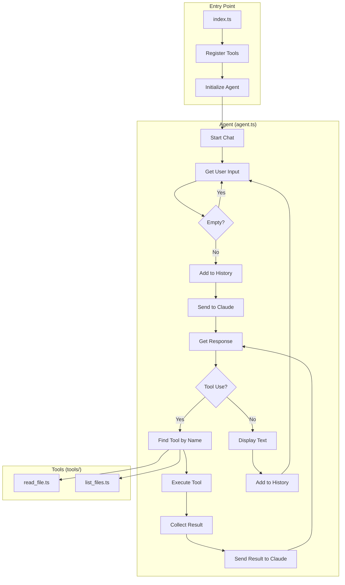

# Chapter 4: The Framework

This chapter represents the final, stable architecture of the project. It moves beyond simple scripts to a **Modular Framework** that prioritizes separation of concerns, type safety, and extensibility.

## The Goal

Transform the duplicated code from Chapters 2-3 into a proper modular architecture where adding new tools requires only creating a new file and registering it.

## File Structure

```
chapter4/
├── index.ts              # Entry point - wires everything together
├── agent.ts              # The core Agent class
├── types.ts              # Shared TypeScript interfaces
└── tools/
    ├── read_file.ts      # File reading tool
    └── list_files.ts     # Directory listing tool (recursive)
```

## Code Walkthrough

### 1. Shared Types (`types.ts`)

```typescript
import Anthropic from "@anthropic-ai/sdk";

export interface ToolDefinition {
    Param: Anthropic.Tool;
    Execute: (args: any) => Promise<string>;
}
```

**What's happening:**
- The `ToolDefinition` interface is now in its own file
- Any file can import it without duplicating the definition
- This is the contract all tools must satisfy

### 2. The Core Agent (`agent.ts`)

```typescript
import { ToolDefinition } from "./types";
import { logger } from "../logger";
import { console_out } from "../console";

export class Agent {
    private client: Anthropic;
    private rl: readline.Interface;
    private verbose: boolean;
    private tools: ToolDefinition[];

    constructor(
        client: Anthropic,
        rl: readline.Interface,
        tools: ToolDefinition[],
        verbose?: boolean
    ) {
        this.client = client;
        this.rl = rl;
        this.tools = tools;
        this.verbose = !!verbose;
    }
}
```

**What's happening:**
- Agent is now exported from its own module
- Imports shared `ToolDefinition` from `types.ts`
- Uses shared utilities (`logger`, `console_out`)
- Completely tool-agnostic—doesn't know what tools it has

### 3. Tool Files (`tools/read_file.ts`)

```typescript
import { ToolDefinition } from "../types";

const ReadFileInputSchema = z.object({
    path: z.string().describe("Path to the file to read"),
});

const ReadFile = async (args: z.infer<typeof ReadFileInputSchema>): Promise<string> => {
    const filePath = path.resolve(process.cwd(), args.path);
    return await readFile(filePath, "utf-8");
}

export const ReadFileToolDefinition: ToolDefinition = {
    Param: {
        name: "read_file",
        description: "Read the contents of a given relative file path...",
        input_schema: GenerateSchema(ReadFileInputSchema)
    },
    Execute: ReadFile
}
```

**What's happening:**
- Tool imports `ToolDefinition` from parent's `types.ts`
- Uses `path.resolve()` to handle relative paths properly
- Exports only the `ToolDefinition`—clean public API

### 4. Enhanced list_files Tool (`tools/list_files.ts`)

```typescript
async function listFilesRecursive(dir: string, baseDir: string = ""): Promise<string[]> {
    const entries = await readdir(dir, { withFileTypes: true });
    let files: string[] = [];

    for (const entry of entries) {
        const fullPath = path.join(dir, entry.name);
        const relativePath = path.join(baseDir, entry.name);

        if (entry.isDirectory()) {
            // Skip common large directories
            if (entry.name === ".git" || entry.name === "node_modules") {
                continue;
            }
            const subFiles = await listFilesRecursive(fullPath, relativePath);
            files = files.concat(subFiles);
        } else {
            files.push(relativePath);
        }
    }
    return files;
}

const ListFiles = async (args: z.infer<typeof ListFilesInputSchema>): Promise<string> => {
    const dirPath = path.resolve(process.cwd(), args.path);
    const files = await listFilesRecursive(dirPath);
    return files.join("\n");
}
```

**What's happening:**
- Unlike Chapter 3's flat listing, this recursively explores directories
- Skips `.git` and `node_modules` to avoid overwhelming output
- Returns relative paths from the requested directory
- Uses `withFileTypes: true` for efficient directory detection

### 5. Entry Point (`index.ts`)

```typescript
import { Agent } from "./agent";
import { ListFilesToolDefinition } from "./tools/list_files";
import { ReadFileToolDefinition } from "./tools/read_file";
import { logger } from "../logger";
import { console_out } from "../console";

async function main() {
    const program = new Command();
    program
        .option("-v, --verbose", "Enable verbose logging")
        .parse(process.argv);

    const options = program.opts();
    const verbose = !!options.verbose;

    if (verbose) {
        logger.level = "debug";
    }

    const client = new Anthropic();
    const rl = readline.createInterface({
        input: process.stdin,
        output: process.stdout,
    });

    // Register tools here
    const tools = [ListFilesToolDefinition, ReadFileToolDefinition];

    const agent = new Agent(client, rl, tools, verbose);

    try {
        await agent.run();
    } catch (err) {
        console_out.error(err instanceof Error ? err.message : String(err));
    } finally {
        rl.close();
    }
}

main().catch((err) => {
    console_out.error(err instanceof Error ? err.message : String(err));
    process.exit(1);
});
```

**What's happening:**
- Clean separation: imports Agent, tools, and utilities
- Tool registration is a simple array
- Proper error handling with try/catch/finally
- Async main function pattern with proper exit handling

## Key Concepts

### Separation of Concerns

| File | Responsibility |
|------|----------------|
| `types.ts` | Type definitions |
| `agent.ts` | Conversation loop, tool dispatch |
| `tools/*.ts` | Individual tool implementations |
| `index.ts` | Wiring and configuration |

### Adding a New Tool

1. **Create the file**: `tools/my_new_tool.ts`
2. **Define schema and executor**:
   ```typescript
   import { ToolDefinition } from "../types";

   const MyToolInputSchema = z.object({
       param: z.string().describe("What this param does"),
   });

   const MyTool = async (args) => {
       // Implementation
       return "result";
   }

   export const MyToolDefinition: ToolDefinition = {
       Param: { name: "my_tool", description: "...", input_schema: GenerateSchema(MyToolInputSchema) },
       Execute: MyTool
   }
   ```
3. **Register in index.ts**:
   ```typescript
   import { MyToolDefinition } from "./tools/my_new_tool";
   const tools = [ListFilesToolDefinition, ReadFileToolDefinition, MyToolDefinition];
   ```

### Comparison with Previous Chapters

| Aspect | Chapters 2-3 | Chapter 4 |
|--------|--------------|-----------|
| Agent class | Duplicated in each file | Single shared module |
| ToolDefinition | Defined inline | Shared in `types.ts` |
| Tools | In same file as agent | Separate `tools/` directory |
| Entry point | Mixed with agent logic | Clean `index.ts` |

## Flow Diagram



## How to Run

```bash
# Standard run
bun run chapter4/index.ts

# With debug logging
bun run chapter4/index.ts --verbose
```

## Example Session

```
╭──────────────────────────────────────────────────────╮
│ Chat with Claude (use 'ctrl-c' to quit)              │
╰──────────────────────────────────────────────────────╯

You › What TypeScript files are in this project?

Claude › I'll list the files for you.
[Uses list_files tool recursively]

Claude › Here are the TypeScript files in the project:
- chapter1/index.ts
- chapter2/read_file.ts
- chapter3/list_files.ts
- chapter3/read_file.ts
- chapter4/index.ts
- chapter4/agent.ts
- chapter4/types.ts
- chapter4/tools/read_file.ts
- chapter4/tools/list_files.ts
- logger.ts
- console.ts

You › Show me the agent.ts file

Claude › I'll read that file for you.
[Uses read_file tool]

Claude › Here's the contents of chapter4/agent.ts:
[displays file content]
```

## What's Next?

Chapter 4 establishes a solid foundation. Future extensions could include:
- **More tools**: bash execution, file editing, code search
- **System prompts**: Give Claude context about its environment
- **Streaming**: Display responses as they arrive
- **Memory**: Persist conversation across sessions
- **Multi-model support**: Switch between Claude models
