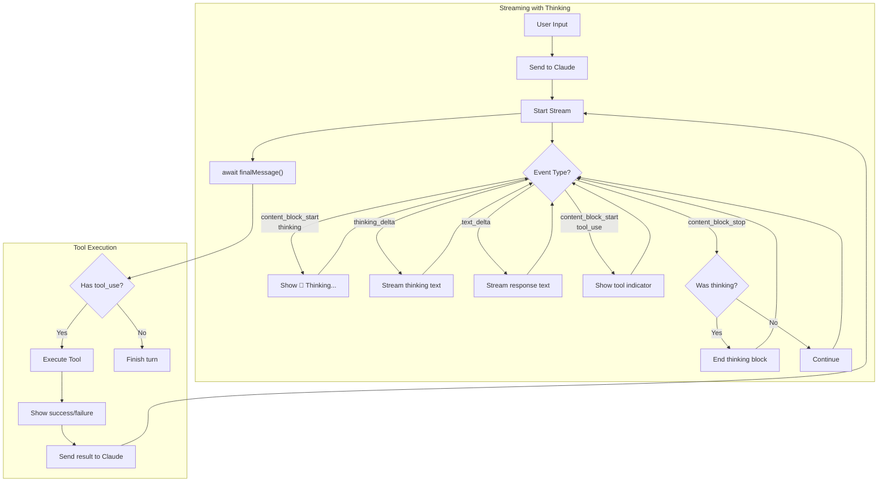
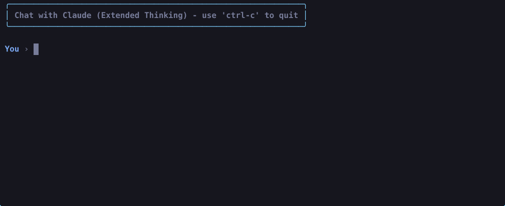

# Chapter 7: Extended Thinking

In this chapter, we add extended thinking capabilities to make Claude's reasoning process visible. Instead of only seeing the final answer, you can now watch Claude think through problems step-by-step with visual indicators showing when reasoning is happening.

## The Goal

Make Claude's thought process transparent by:
1. Enabling extended thinking with the Anthropic API
2. Streaming thinking content as it's generated
3. Displaying thinking blocks with clear visual cues

## New Features

### 1. Extended Thinking API

We enable Claude's extended thinking mode with a generous token budget:

```typescript
const stream = this.client.messages.stream({
  model: "claude-sonnet-4-20250514",
  max_tokens: 16000,
  thinking: {
    type: "enabled",
    budget_tokens: 10000,
  },
  messages: conversation,
  tools: anthropicTools,
});
```

### 2. Thinking Content Streaming

Claude's thinking appears in real-time as it's generated, styled in dimmed cyan to differentiate from regular responses:

```typescript
stream.on("streamEvent", (event) => {
  if (event.type === "content_block_delta" &&
      event.delta.type === "thinking_delta") {
    console_out.thinkingStream(event.delta.thinking);
  }
});
```

### 3. Visual Thinking Indicators

Thinking blocks have clear visual boundaries:
- `💭 Thinking...` — header when thinking begins
- Dimmed cyan text — the actual thinking content
- Blank line separator — marks the end of thinking

## Anthropic Thinking Events

The streaming API provides specialized events for thinking content:

| Event Type | When | Content |
|------------|------|---------|
| `content_block_start` | Thinking block begins | `content_block.type === "thinking"` |
| `content_block_delta` | Thinking content arrives | `delta.type === "thinking_delta"` |
| `content_block_stop` | Thinking block ends | Block finished |

## File Structure

```
7-extended-thinking/
├── index.ts              # Entry point
├── agent.ts              # Agent with thinking support
├── types.ts              # Shared interfaces
└── tools/
    ├── list_files.ts
    ├── read_file.ts
    ├── bash_tool.ts
    ├── edit_tool.ts
    └── grep.ts
```

## Key Changes from Chapter 6

### agent.ts
- Added `isThinking: boolean` flag to track thinking state
- Configured thinking API with 10000 token budget
- Added `handleStreamEvent()` method to process thinking events:
  - Detects `content_block_start` with `type === "thinking"`
  - Streams thinking deltas with `thinking_delta`
  - Closes thinking blocks on `content_block_stop`

### console.ts (shared)
Updated tool status visualization to a structured "boxed" format:
- `toolStart(name, input)` — displays a header with `⚡ Calling [name]` and a horizontal separator. It also prints indented input parameters (e.g., file paths or commands).
- `toolEnd(name, success)` — displays a footer with `✓ Finished [name]` (or `✗ Failed`) and a horizontal separator to clearly bound the tool's output.
Added three new methods for thinking visualization:
- `thinkingStart()` — displays 💭 header
- `thinkingStream(delta)` — prints dimmed cyan thinking text
- `thinkingEnd()` — adds separator line

## Flow Diagram



## How to Run

```bash
# Standard run
bun run 7-extended-thinking/index.ts

# With debug logging
bun run 7-extended-thinking/index.ts --verbose
```

## Example Session



## What's Next

Here are some directions future chapters may explore:

- **Persistent Context** — save conversation history across sessions using SQLite or JSON
- **Parallel Tool Execution** — run independent tools concurrently with `Promise.all()`
- **Web Search** — integrate a search API for real-time information retrieval
- **Code Sandbox** — execute code safely in an isolated environment
- **MCP Integration** — connect to external tools via the Model Context Protocol
- **Image Understanding** — process screenshots and diagrams with vision capabilities
- **Multi-Agent Coordination** — orchestrate multiple specialized agents working together
