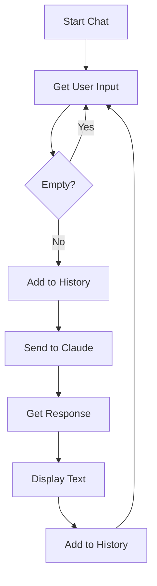

# Chapter 1: The Inception

This chapter establishes the foundation—a simple conversational agent that maintains context across multiple exchanges with Claude.

## The Goal

Create a basic CLI application that can hold a stateful conversation with Claude. No tools, no complexity—just the core message loop.

## File Structure

```
chapter1/
└── index.ts      # Complete agent implementation
```

## Code Walkthrough

### 1. Entry Point & CLI Setup

```typescript
import { Command } from "commander";
import * as readline from "readline/promises";
import Anthropic from "@anthropic-ai/sdk";
import { logger } from "../logger";
import { console_out } from "../console";

const program = new Command();

program
    .version("1.0.0")
    .description("A TypeScript CLI")
    .option("-v, --verbose", "verbose output")
    .action(async (options) => {
        // ... agent initialization
    });
```

**What's happening:**
- `commander` provides CLI argument parsing (`--verbose` flag)
- `readline/promises` handles interactive user input
- `@anthropic-ai/sdk` manages API communication with Claude
- Shared utilities (`logger`, `console_out`) handle output formatting

### 2. Agent Class

```typescript
class Agent {
    private client: Anthropic;
    private rl: readline.Interface;
    private verbose: boolean;

    constructor(client: Anthropic, rl: readline.Interface, verbose: boolean) {
        this.client = client;
        this.rl = rl;
        this.verbose = verbose;
    }
}
```

**What's happening:**
- The `Agent` class encapsulates the conversation logic
- It holds references to the Anthropic client, readline interface, and verbosity setting
- This is a **monolithic** design—everything in one class

### 3. The Conversation Loop

```typescript
async run() {
    const conversation: Anthropic.MessageParam[] = [];

    console_out.banner("Chat with Claude (use 'ctrl-c' to quit)");

    while (true) {
        let userInput: string;
        try {
            userInput = await this.rl.question(console_out.userPromptString());
        } catch {
            break;  // User pressed Ctrl+C
        }

        if (!userInput) continue;  // Skip empty messages

        // Add user message to history
        conversation.push({ role: "user", content: userInput });

        // Get Claude's response
        const message = await this.runInference(conversation);

        // Add assistant response to history
        conversation.push({ role: "assistant", content: message.content });

        // Display the response
        for (const block of message.content) {
            if (block.type === "text") {
                console_out.claude(block.text);
            }
        }
        console_out.finishClaudeTurn();
    }
}
```

**What's happening:**
1. **Initialize history**: Empty array to store conversation messages
2. **Input loop**: Wait for user input via readline
3. **Append user message**: Add to conversation history with `role: "user"`
4. **Call Claude**: Send entire history to maintain context
5. **Append response**: Add Claude's reply with `role: "assistant"`
6. **Display**: Show the response to the user
7. **Repeat**: Loop back for next input

### 4. The Inference Method

```typescript
async runInference(conversation: Anthropic.MessageParam[]) {
    const message = await this.client.messages.create({
        model: "claude-3-5-haiku-latest",
        max_tokens: 1024,
        messages: conversation,
    });
    return message;
}
```

**What's happening:**
- Sends the full conversation history to Claude
- Uses `claude-3-5-haiku-latest` for fast responses
- Returns the complete message object

## Key Concepts

### Conversation History

The `conversation` array maintains state:

```typescript
[
    { role: "user", content: "Hello!" },
    { role: "assistant", content: "Hi there! How can I help?" },
    { role: "user", content: "What's 2+2?" },
    { role: "assistant", content: "2+2 equals 4." }
]
```

Each API call includes the full history, allowing Claude to understand context from earlier messages.

### Message Content Blocks

Claude's response contains `content` as an array of blocks:

```typescript
message.content = [
    { type: "text", text: "Hello! How can I help you today?" }
]
```

In Chapter 1, we only handle `text` blocks. Tool blocks come in Chapter 2.

## Flow Diagram



## How to Run

```bash
# Standard run
bun run chapter1/index.ts

# With debug logging
bun run chapter1/index.ts --verbose
```

## What's Next?

Chapter 1 establishes the basic loop, but Claude can only talk—it cannot take actions. In **Chapter 2**, we introduce **tools** that allow Claude to read files from the filesystem.
