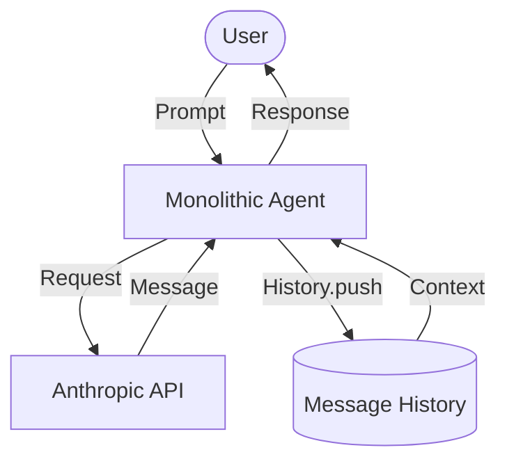
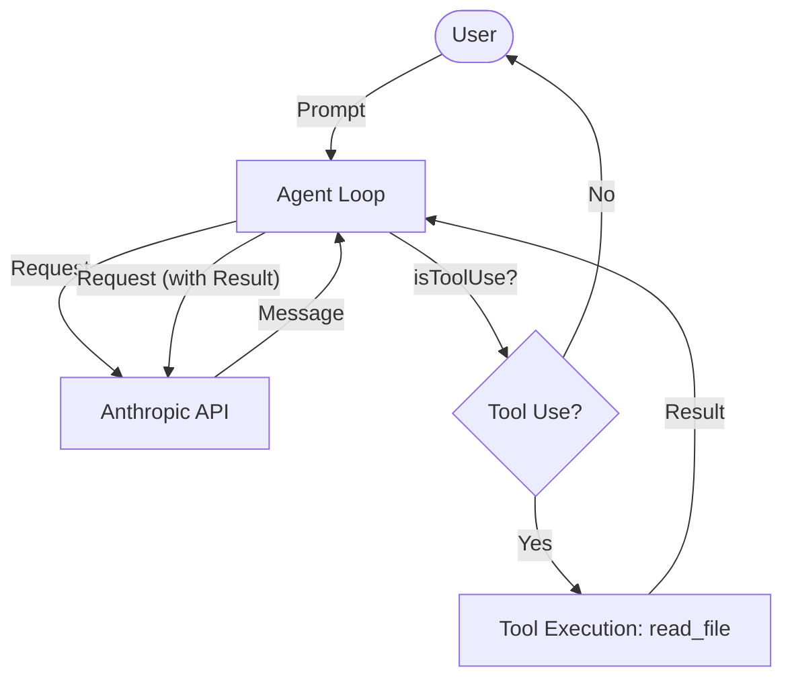
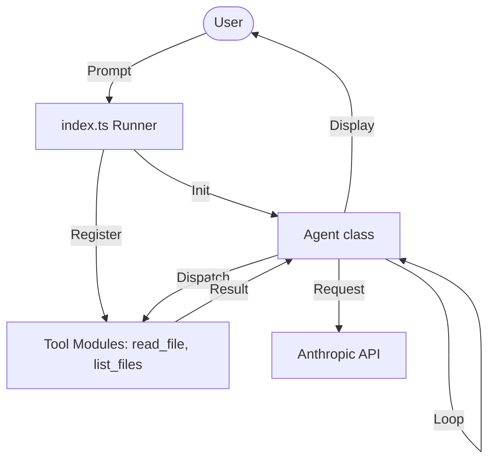
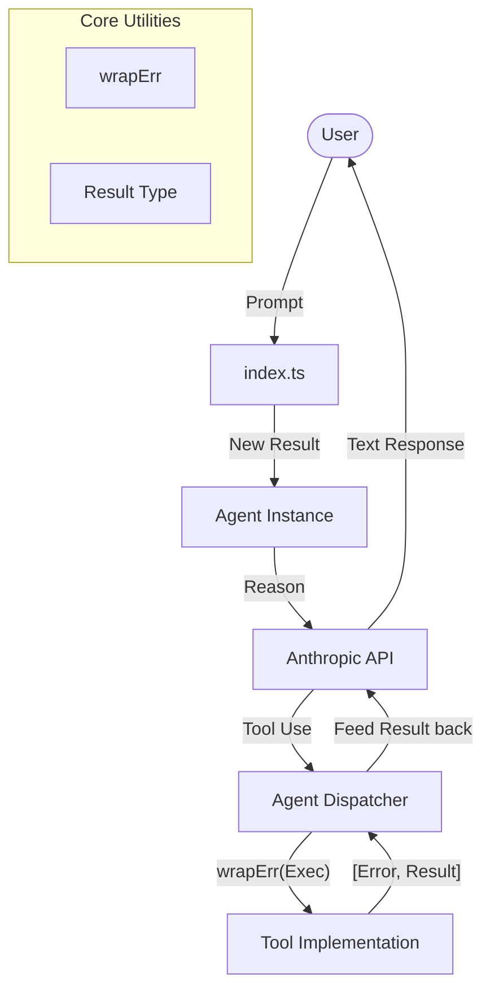

# AI Coding Agent Framework (TypeScript)

This repository demonstrates the step-by-step evolution of a modular AI coding agent framework built with TypeScript and the Anthropic SDK.

## Project Overview

The project is structured into chapters, each representing a distinct iteration in the agent's development—from a simple message loop to a mature, tool-capable framework.

### Chapters

- **[Chapter 1: The Inception](./chapter1)**: Building the basic message loop and CLI interface.
- **[Chapter 2: Empowerment](./chapter2)**: Introducing tool integration with the `read_file` capability.
- **[Chapter 3: Refinement](./chapter3)**: Refactoring into an abstracted Agent class and adding the recursive `list_files` tool.
- **[Chapter 4: The Framework](./chapter4)**: A mature, modular architecture with standardized patterns and extensibility.

## Evolutionary Overview

The following diagrams illustrate the incremental evolution of the agent framework's architecture.

### Chapter 1: The Inception


### Chapter 2: Empowerment


### Chapter 3: Refinement


### Chapter 4: The Framework


## Architecture & Core Patterns

### Go-Style Error Handling
A central theme in this project (specifically from Chapter 4 onwards) is the adoption of a **Go-style error handling pattern**. This approach avoids the cognitive overhead and "pyramid of doom" often associated with `try-catch` blocks.

The `wrapErr` utility ensures that asynchronous operations return a standardized tuple:

```typescript
type Result<T> = Promise<[Error, undefined] | [undefined, T]>;
```

**Why this pattern?**
1. **Explicit Handling**: Errors must be explicitly handled or ignored, making the code's failure paths visible.
2. **Type Safety**: Using discriminated unions ensures you cannot access the result if an error exists.
3. **Simplicity**: Keeps the happy path linear and easy to read.

### Key Dependencies

- **[Anthropic SDK](https://github.com/anthropics/anthropic-sdk-typescript)**: Powers the inference loop and message handling.
- **[Commander](https://github.com/tj/commander.js)**: Provides the CLI argument parsing.
- **[Zod](https://zod.dev)**: Used for data validation and generating JSON schemas for tools.

## Getting Started

1. **Install Dependencies**:
   ```bash
   npm install
   ```
2. **Configure API Key**:
   ```bash
   export ANTHROPIC_API_KEY='your-key-here'
   ```
3. **Run Implementation**:
   ```bash
   bun run chapter4/index.ts --verbose
   ```
