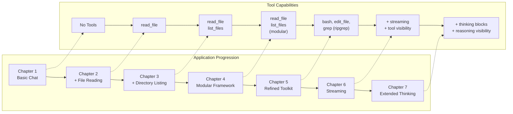
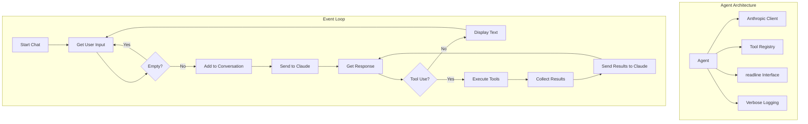

# Build Your Own AI Coding Agent (TypeScript)

A step-by-step workshop for building an AI-powered coding assistant using TypeScript and the Anthropic Claude API.

## What You'll Learn

By the end of this workshop, you'll understand how to:

- Connect to the Anthropic Claude API
- Build a simple AI chatbot with conversation history
- Add tools like reading files and listing directories
- Handle tool requests and errors gracefully
- Build a modular agent framework that's easy to extend

## What We're Building

You'll build 7 versions of a coding assistant, each adding more capabilities:

1. **Basic Chat** — talk to Claude
2. **File Reader** — read code files
3. **File Explorer** — list files in folders
4. **Modular Framework** — clean, extensible architecture
5. **Refined Toolkit** — powerful tools like bash, edit, and grep
6. **Streaming Responses** — real-time text and tool visibility
7. **Extended Thinking** — see Claude's reasoning process in real-time



## How It Works (Architecture)

Each agent works like this:

1. Waits for your input
2. Sends it to Claude
3. Claude may respond directly or ask to use a tool
4. The agent runs the tool (e.g., read a file)
5. Sends the result back to Claude
6. Claude gives you the final answer

This is the **agentic loop** — it's what makes the assistant "smart."



## Getting Started

### Prerequisites

- [Bun](https://bun.sh/) runtime (or Node.js 18+)
- An [Anthropic API Key](https://console.anthropic.com/)

### Setup

```bash
# Clone and install
bun install

# Add your API key
export ANTHROPIC_API_KEY="your-api-key-here"
```

## Workshop Path

### Chapter 1: Basic Chat

A simple chatbot that talks to Claude with conversation history.

```bash
bun run chapter1/index.ts
```

**Try it:**
- "Hello!"
- "What's 2+2?"
- "What did I just ask you?" (tests memory)

**What you'll learn:**
- Anthropic SDK basics
- Conversation history management
- The message loop pattern

### Chapter 2: File Reader

Now Claude can read files from your computer.

```bash
bun run chapter2/read_file.ts
```

**Try it:**
- "Read package.json"
- "What dependencies does this project use?"

**What you'll learn:**
- Tool definition with Zod schemas
- The tool use loop
- Handling tool results

### Chapter 3: File Explorer

Adds directory listing so Claude can explore your codebase.

```bash
bun run chapter3/list_files.ts
```

**Try it:**
- "List all files in this directory"
- "What's in the chapter3 folder?"

**What you'll learn:**
- Adding multiple tools
- Tool dispatch by name
- Error handling patterns

### Chapter 4: The Framework

A modular architecture with separation of concerns.

```bash
bun run chapter4/index.ts
```

**Try it:**
- "What TypeScript files are in this project?"
- "Show me the agent.ts file"

**What you'll learn:**
- Modular code organization
- Shared type definitions
- Clean entry point pattern
- How to add new tools easily

### Chapter 5: Refined Toolkit

Expands the agent's capabilities with powerful search, edit, and shell tools.

```bash
bun run chapter5/index.ts
```

**Try it:**
- "Find all occurrences of 'Claude' in this project"
- "Fix the typo in Chapter 5 README"
- "Run ls -la using the bash tool"

**What you'll learn:**
- Implementing advanced tools (bash, edit_file)
- Integrating high-performance search with Ripgrep
- Externalizing tool descriptions for better prompt management
- Automatic dependency management (downloading Ripgrep binary)

### Chapter 6: Streaming Responses

Enhances the user experience with real-time streaming output and tool visibility.

```bash
bun run 6-streaming-response/index.ts
```

**Try it:**
- "What files are in this project?" (watch text stream in real-time)
- "Read package.json and summarize it" (see tool calls as they happen)

**What you'll learn:**
- Using the Anthropic streaming API (`client.messages.stream()`)
- Handling streaming events (`text`, `streamEvent`, `contentBlock`)
- Showing tool calls before execution with `content_block_start`
- Building responsive CLI output with `process.stdout.write()`

### Chapter 7: Extended Thinking

Makes Claude's reasoning process visible with thinking blocks and real-time streaming.

```bash
bun run 7-thinking-tokens/index.ts
```

**Try it:**
- "Find all TypeScript files with potential bugs" (watch Claude reason through the problem)
- "Create a new tool for counting code lines" (see planning and decision-making)
- Use `--verbose` for debug logging

**What you'll learn:**
- Extended thinking API with `thinking: { type: "enabled", budget_tokens: 10000 }`
- Handling thinking stream events (`thinking_delta`)
- Visual indicators for thinking blocks (💭 with dimmed cyan text)
- Simple state management with boolean flags
- Reusing existing console utilities for new features

## Chapter Overview

| Chapter | Focus | Tools Available |
|---------|-------|-----------------|
| 1 | API basics, conversation history | None |
| 2 | Tool definition, tool use loop | `read_file` |
| 3 | Multiple tools, error handling | `read_file`, `list_files` |
| 4 | Modular architecture, extensibility | `read_file`, `list_files` |
| 5 | Advanced toolkit & infrastructure | `read_file`, `list_files`, `bash`, `edit_file`, `grep` |
| 6 | Streaming responses, tool visibility | Same as Chapter 5 + streaming |
| 7 | Extended thinking, reasoning visibility | Same as Chapter 6 + thinking blocks |

## File Structure

```
code-agent-ts/
├── chapter1/
│   └── index.ts           # Basic chat agent
├── chapter2/
│   └── read_file.ts       # Agent + read_file tool
├── chapter3/
│   ├── read_file.ts       # Agent + read_file tool
│   └── list_files.ts      # Agent + list_files tool
├── chapter4/
│   ├── index.ts           # Entry point
│   ├── agent.ts           # Core Agent class
│   ├── types.ts           # Shared interfaces
│   └── tools/
│       ├── read_file.ts   # File reading tool
│       └── list_files.ts  # Directory listing tool
├── chapter5/
│   ├── index.ts           # Entry point
│   ├── agent.ts           # Core Agent class (inherited)
│   ├── ripgrep/           # Ripgrep downloader & utility
│   └── tools/
│       ├── bash_tool.ts   # Shell command tool
│       ├── edit_tool.ts   # File editing tool
│       ├── grep.ts        # Advanced search tool
│       └── tool_description/ # Externalized descriptions
├── 6-streaming-response/
│   ├── index.ts           # Entry point
│   ├── agent.ts           # Agent with streaming support
│   ├── types.ts           # Shared interfaces
│   ├── ripgrep/           # Ripgrep downloader
│   └── tools/             # Same tools as Chapter 5
├── 7-thinking-tokens/
│   ├── index.ts           # Entry point
│   ├── agent.ts           # Agent with thinking support
│   ├── types.ts           # Shared interfaces
│   └── tools/             # Same tools as Chapter 6
├── logger.ts              # Pino structured logging
├── console.ts             # Terminal output utilities
└── README.md
```

## Key Technologies

| Technology | Purpose |
|------------|---------|
| [Anthropic SDK](https://github.com/anthropics/anthropic-sdk-typescript) | Claude API integration |
| [Zod](https://zod.dev) | Schema validation & JSON Schema generation |
| [Commander](https://github.com/tj/commander.js) | CLI argument parsing |
| [Pino](https://github.com/pinojs/pino) | Structured logging |
| [picocolors](https://github.com/alexeyraspopov/picocolors) | Terminal colors |
| [boxen](https://github.com/sindresorhus/boxen) | Terminal boxes |

## Verbose Mode

All chapters support `--verbose` for debug logging:

```bash
bun run 4-agent-tool-orchestration/index.ts --verbose
```

This shows:
- When messages are sent to Claude
- Tool executions and results
- Conversation history length
- API call timing

## Adding Your Own Tools

Once you complete Chapter 4, adding new tools is simple:

1. **Create the file**: `4-agent-tool-orchestration/tools/my_tool.ts`
2. **Define the schema and executor**
3. **Register in `index.ts`**

See [Chapter 4 README](./4-agent-tool-orchestration/README.md) for detailed instructions.

## Troubleshooting

**API key not working?**
- Make sure it's exported: `echo $ANTHROPIC_API_KEY`
- Check your quota on [Anthropic's console](https://console.anthropic.com/)

**Bun errors?**
- Update Bun: `bun upgrade`
- Or use Node.js: `npx tsx 4-agent-tool-orchestration/index.ts`

**Tool errors?**
- Use `--verbose` for detailed logs
- Check file paths and permissions

## What's Next?

After completing the workshop, try extending with:
- **System prompts**: Give Claude context about the project
- **Extended thinking**: Show Claude's reasoning process
- **Parallel tool execution**: Run multiple tools concurrently
- **Tool cancellation**: Allow users to abort mid-stream
- **Context management**: Handle long conversations efficiently
