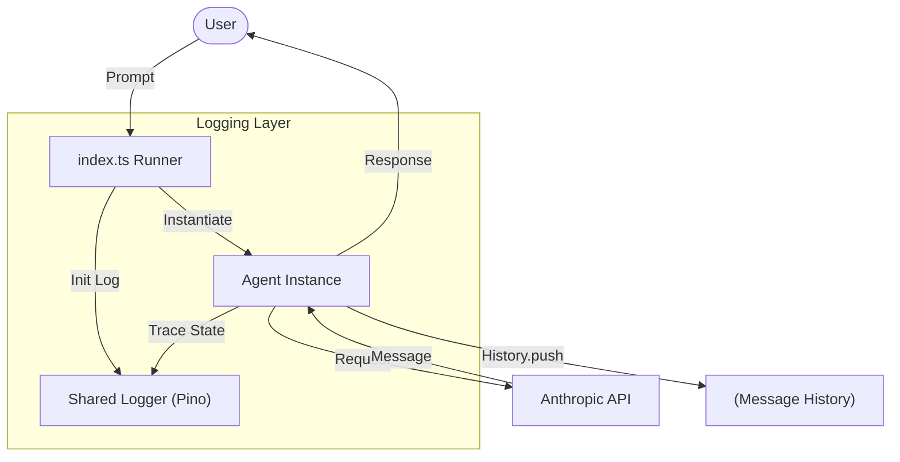

# Chapter 2: The Agent Primitive

This chapter introduces the concept of an `Agent` as a structured class, paving the way for more complex behaviors and tool integration.

## The Goal
In Chapter 1, the logic was monolithic. To scale, we need to encapsulate the conversation loop and model interaction into a reusable **Primitive**. The focus here is on **Encapsulation** and starting the transition toward a tool-aware architecture.

## Architecture
We introduce the `Agent` class, which takes ownership of the interaction loop.

- **[index.ts](file:///Users/m.rathod/Documents/Projects/code-agent-ts/chapter2/index.ts)**: Implementation of the `Agent` class and the CLI runner.

### Encapsulation
The logic is now divided into:
1. **Runner**: Handles CLI flags, environment setup, and input/output streams.
2. **Agent**: Manages the persistent conversation state and the iterative reasoning loop.

### Logging Pattern
We continue to use the shared `logger.ts`. By moving the loop into a class, we can easily pass configuration (like the `verbose` flag) to the agent, allowing it to log its internal state transitions clearly.

## Why Encapsulate?
- **Maintainability**: The runner doesn't need to know *how* the agent thinks.
- **State Management**: The `Agent` class naturally holds the `conversation` history.
- **Foundation for Tools**: By having a dedicated loop, we can later insert logic to intercept model requests and dispatch them to external functions.

### Flow Diagram


## How to Run
```bash
bun run chapter2/index.ts --verbose
```
