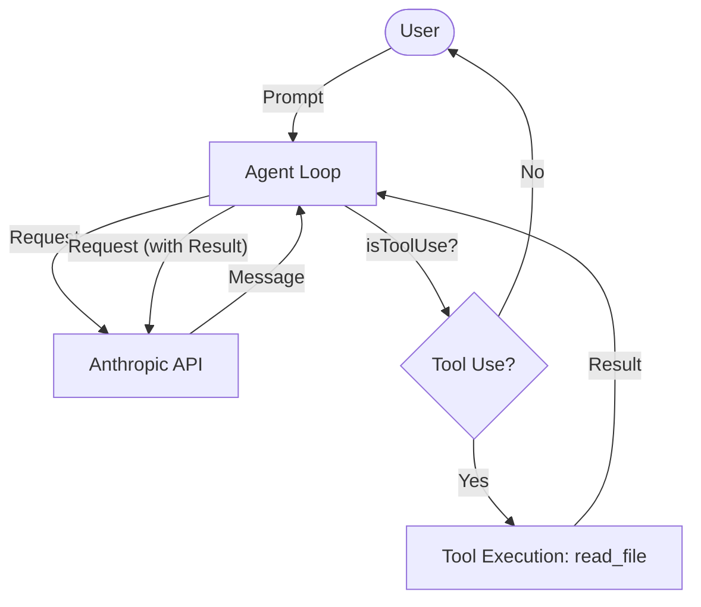

# Chapter 2: Empowerment through Tools

This chapter expands the agent's capabilities by moving from a simple chat interface to an "active" tool-using agent.

## The Goal
A chat agent is limited by its training data. To be useful in a development context, it needs the ability to observe the environment. The focus here was to implement **Tool Integration**, specifically allowing the agent to read files from the local filesystem.

## Evolution of the Loop
In this iteration, the agent's architecture begins to shift. We introduce a mechanism for the model to signal that it wants to perform an action.

- **[index.ts](file:///Users/m.rathod/Documents/Projects/code-agent-ts/chapter2/index.ts)**: The primary entry point. While similar to Chapter 1, it lays the groundwork for tool-aware prompting.
- **[tools/read.ts](file:///Users/m.rathod/Documents/Projects/code-agent-ts/chapter2/tools/read.ts)**: A self-contained execution script that demonstrates a specific tool implementation for reading files.

### Tool Definition & Schemas
We started using **Zod** to define the expected input for each tool. This allows us to:
1. Validate the model's output before execution.
2. Automatically generate the JSON Schema that Claude needs to understand how to use the tool.

### The read_file Capability
The first tool implemented was `read_file`. This required:
- **Node.js `fs` interaction**: Safely reading file contents.
- **Tool Mapping**: A registry that maps the model's requested tool name to the actual TypeScript function.
- **Result Feedback**: Feeding the content of the file (or an error message) back into the conversation history so the model can process it.

## Lessons Learned
This chapter highlighted the importance of clear error messages. If a file doesn't exist, the agent must report this back to the model gracefully so it can try a different approach or inform the user.

### Flow Diagram


## How to Run
```bash
bun run chapter2/tools/read.ts --verbose
```
