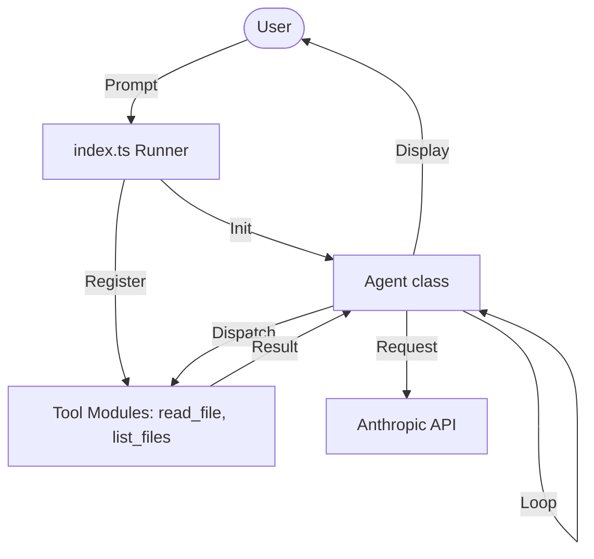

# Chapter 3: Refinement & Modularity

As the number of tools grew, the monolithic structure of the agent became difficult to maintain. This chapter focuses on **Refactoring for Modularity**.

## The Goal
The objective was to decouple the agent's core "reasoning engine" (the loop and API interaction) from the specific capabilities (the tools) it possesses.

## Architectural Shift
We introduced an abstracted `Agent` class. This allows us to instantiate multiple agents with different sets of tools or logging configurations without duplicating code.

- **[index.ts](file:///Users/m.rathod/Documents/Projects/code-agent-ts/chapter3/index.ts)**: Demonstrates the "monolithic-agent" pattern but with cleaner internal logic.
- **[tools/list_files.ts](file:///Users/m.rathod/Documents/Projects/code-agent-ts/chapter3/tools/list_files.ts)**: A self-contained script demonstrating a recursive directory listing tool.

### Recursive Discovery: The `list_files` Tool
To demonstrate the power of more complex tools, we implemented `list_files`. Unlike a simple read command, this tool explores the project structure recursively.

**Key Features:**
- **Filtering**: Automatically ignores noise like `.git` and `node_modules` to keep the model's context clean.
- **Traversal**: Uses asynchronous directory walking to build a comprehensive view of the codebase.
- **Standardization**: Tools now start to follow a consistent interface, making it easier to plug them into the `Agent` class.

## Why Refactor?
- **Testability**: Individual tools can be tested in isolation.
- **Scalability**: Adding a third or fourth tool doesn't require touching the agent's core loop logic.
- **Reusability**: The `Agent` class is now a primitive that can be used across different implementation scripts.

### Flow Diagram


## How to Run
```bash
bun run chapter3/tools/list_files.ts --verbose
```
