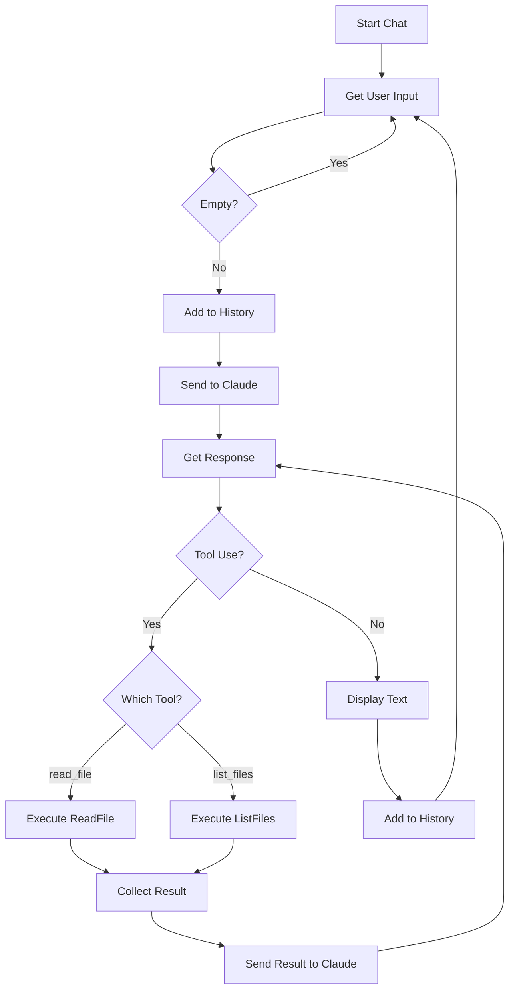

# Chapter 3: Extending Tools

This chapter demonstrates how to **extend the tool set** by adding new capabilities following the pattern established in Chapter 2.

## The Goal
In Chapter 2, we created `read_file`. Now we extend the agent with a second tool: `list_files`. This shows how the same pattern scales to multiple tools.

## Architecture
This chapter contains both tools from the progression:

- **[tools/read_file.ts](tools/read_file.ts)**: The file reading tool (from Chapter 2 pattern).
- **[tools/list_files.ts](tools/list_files.ts)**: The new directory listing tool.
- **[index.ts](index.ts)**: A basic agent without tools (for comparison).

### Adding a New Tool
To add `list_files`, we follow the same pattern as `read_file`:
1. **Define the Zod Schema**: Specify the `path` parameter.
2. **Implement the Execute Function**: Use `readdir` to list directory contents.
3. **Create the ToolDefinition**: Register the schema and executor.

### Tool Comparison
| Tool | Input | Output | Use Case |
|------|-------|--------|----------|
| `read_file` | File path | File contents | Reading file content |
| `list_files` | Directory path | File list | Exploring directories |

### Integrated Logging
Both tools use the shared `logger.ts` for consistent logging across the framework.

### Flow Diagram



## How to Run
```bash
# Run with list_files tool
bun run chapter3/tools/list_files.ts --verbose

# Run with read_file tool
bun run chapter3/tools/read_file.ts --verbose
```
