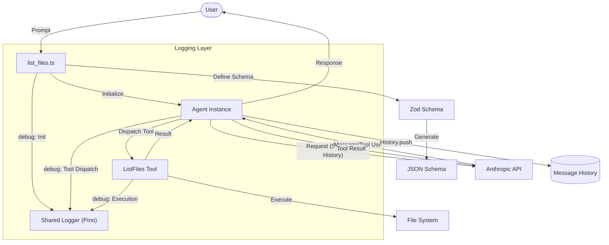

# Chapter 3: Task-Specific Agents

This chapter moves beyond simple chat loops to **Task-Specific Agents**—specialized scripts designed to perform specific capabilities like directory exploration.

## The Goal
The objective here is to demonstrate how an agent can be constrained or specialized for a particular task. Instead of a general-purpose chat, we create entry points that are pre-configured with specific tools.

## Architectural Shift: Standalone Tool Scripts
In this iteration, we focus on specialized files like `tools/list_files.ts`. These aren't just functions; they are full agent implementations that expose a specific capability to the model.

- **[tools/list_files.ts](file:///Users/m.rathod/Documents/Projects/code-agent-ts/chapter3/tools/list_files.ts)**: A specialized agent script for exploration.

### Tool Schemas with Zod
We use **Zod** to define the interface for each tool. This provides:
1. **Validation**: Ensuring the model's generated parameters match our expected types.
2. **Auto-Discovery**: Using our `GenerateSchema` utility to transform Zod objects into the JSON Schema format required by the Anthropic API.

### Integrated Logging
By this stage, the shared `logger.ts` is fully integrated. Task-specific agents use `logger.debug` to trace their reasoning and tool execution steps, while presenting a clean interface to the user.

## Why Task-Specific?
- **Isolation**: Each tool's environment and logic are self-contained.
- **Specialization**: The system prompt can be tailored to the specific task (e.g., "You are a file explorer").
- **Prototyping**: It's easier to iterate on a single capability before merging it into a unified framework.

### Flow Diagram



## How to Run
```bash
bun run chapter3/tools/list_files.ts --verbose
```
