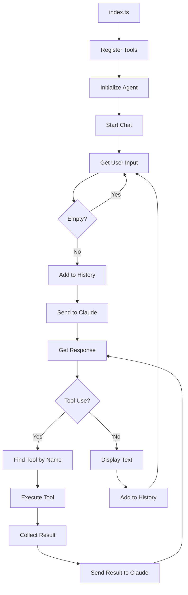

# Chapter 4: The Framework

This chapter represents the final, stable architecture of the project. It moves beyond simple scripts to a **Structured Framework** that prioritizes type safety, logging, and extensibility.

## The Goal
The final objective was to establish a pattern where adding new capabilities is as simple as defining a new tool file and registering it. 

## Mature Architecture
The project is now divided into clear, decoupled layers:

### 1. The Core Agent
The `Agent` class is now completely tool-agnostic. It handles conversation state, inference, and tool dispatching through a standardized interface.

- **[agent.ts](file:///Users/m.rathod/Documents/Projects/code-agent-ts/chapter4/agent.ts)**: A fully abstracted, tool-agnostic agent class.
- **[types.ts](file:///Users/m.rathod/Documents/Projects/code-agent-ts/chapter4/types.ts)**: Shared interfaces for tool definitions and communication.
- **[index.ts](file:///Users/m.rathod/Documents/Projects/code-agent-ts/chapter4/index.ts)**: The clean entry point that wires the agent, tools, and shared logger together.

### 2. Standardized Tools (`tools/`)
Tools are implemented as independent modules that satisfy the `ToolDefinition` interface. This allows for easy registration and discovery.

- **[tools/read_file.ts](file:///Users/m.rathod/Documents/Projects/code-agent-ts/chapter4/tools/read_file.ts)**: Optimized file reading.
- **[tools/list_files.ts](file:///Users/m.rathod/Documents/Projects/code-agent-ts/chapter4/tools/list_files.ts)**: Professional directory listing.

### 3. Integrated Utilities
The framework utilizes shared utilities to ensure consistency across all components:
- **[logger.ts](file:///Users/m.rathod/Documents/Projects/code-agent-ts/logger.ts)**: Structured logging powered by `pino`.
- **Standard TypeScript Patterns**: Error handling and data flow move away from custom wrappers to idiomatic `try-catch` and standard types.

## Extending the Framework
To add a new tool to this framework:
1. **Define**: Create a tool file in the `tools/` directory.
2. **Implement**: Write the function returning a `Promise<string>`.
3. **Describe**: Create a `ToolDefinition` that uses Zod to define the input schema.
4. **Register**: Import and add the tool to the `tools` array in `index.ts`.

### Flow Diagram



## How to Run
```bash
# Standard run
bun run chapter4/index.ts

# Verbose run (debug logs enabled)
bun run chapter4/index.ts --verbose
```
